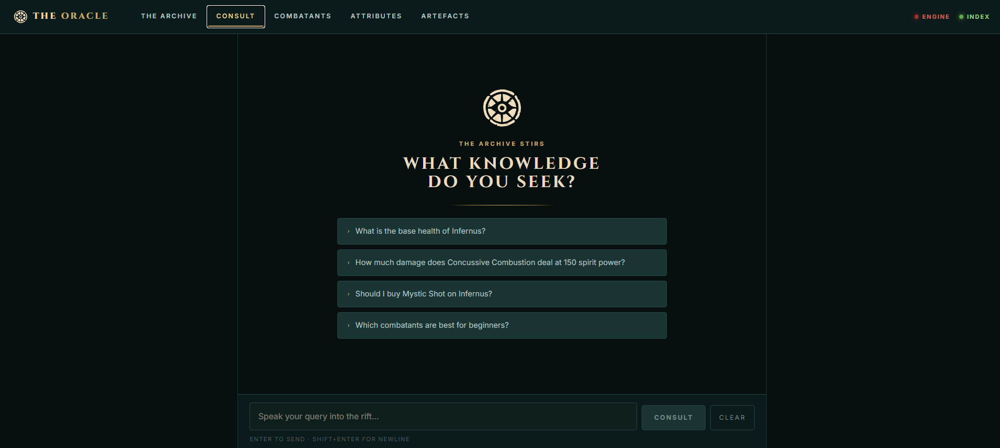
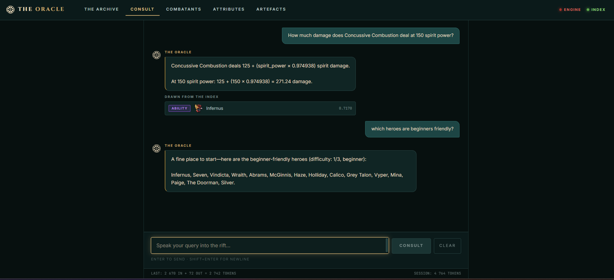

# Deadlock RAG

A data pipeline and RAG (Retrieval-Augmented Generation) system for Valve's *Deadlock*. Extracts hero, ability, and item data from raw `.vdata` game files, indexes them as embeddings in Qdrant, and serves a semantic search + LLM-powered query API with a multi-page web UI.

## Setup

```bash
pip install -r requirements.txt
```

**External services required at runtime:**

| Service | Command |
|---|---|
| Qdrant (first run) | `docker run -d --name qdrant -p 6333:6333 -v $(pwd)/qdrant_storage:/qdrant/storage qdrant/qdrant` |
| Qdrant (subsequent) | `docker start qdrant` |
| Ollama | `ollama serve` |

Ollama models needed:
```bash
ollama pull mxbai-embed-large                       # embeddings
ollama pull deepseek-r1:7b-qwen-distill-q4_K_M     # LLM (default)
```

### LLM provider

The system defaults to Ollama. To switch providers, create a `.env` file in the project root:

```ini
# Ollama (default — no key required)
LLM_PROVIDER=ollama
OLLAMA_MODEL=deepseek-r1:7b-qwen-distill-q4_K_M

# OpenAI (uses gpt-4o-mini)
LLM_PROVIDER=openai
OPENAI_API_KEY=sk-...
OPENAI_MODEL=gpt-4o-mini

# Azure OpenAI (uses gpt-5.4-nano deployment — note: deployment names differ from OpenAI model names)
LLM_PROVIDER=azure
AZURE_OPENAI_API_KEY=...
AZURE_OPENAI_ENDPOINT=https://<resource>.openai.azure.com/
AZURE_OPENAI_DEPLOYMENT=gpt-5.4-nano
AZURE_OPENAI_API_VERSION=2024-02-01
```

## Pipeline

The system runs in two phases: **once** to build the knowledge base, and **on every query** at runtime.

> **Note:** `data/` is not included in the repository. Raw game files are downloaded automatically by the patch monitor on first run. Run the bootstrap step below before starting the server for the first time.

### Bootstrap (fresh clone)

```bash
# Download the latest .vdata and localization files from SteamTracking/GameTracking-Deadlock,
# then run the full build pipeline automatically.
python -m src.updater.patch_monitor
```

This is a one-shot command. It detects that no previous version is known, downloads all watched game files to `data/raw/`, and runs steps 1–6 of the build pipeline. Requires Ollama and Qdrant to be running (for step 6).

### Build pipeline (steps run by patch_monitor automatically)

```bash
# 1. Extract hero + ability data → data/processed/heroes/*.json, heroes_index.json
python src/heroes_abilities_extractor/pipeline.py

# 2. Extract shop/item data → data/processed/shop.json
python src/shop_extractor/pipeline.py

# 3. Scrape hero lore, guides, and wiki text → data/processed/wiki_data.json
python -m src.wiki_scraper.pipeline

# 4. Scrape hero/ability/item icons → injects image URLs into processed JSONs
python -m src.wiki_scraper.image_scraper

# 5. Chunk extracted JSON into RAG-ready pieces → data/processed/chunks.json
python src/rag/chunker.py

# 6. Embed chunks and load into Qdrant (requires Ollama + Qdrant running)
python src/rag/indexer.py
```

### Keeping data up to date

The updater polls [SteamTracking/GameTracking-Deadlock](https://github.com/SteamTracking/GameTracking-Deadlock) for new commits. When relevant `.vdata` or localization files change, it re-downloads them and re-runs all six pipeline steps.

**One-shot check** (run manually when needed):
```bash
python -m src.updater.patch_monitor
```

**Auto-scheduler** (checks on a repeating interval, runs in the background):
```bash
python -m src.updater.scheduler
```

Configure the check interval in `src/config.py`:
```python
UPDATE_INTERVAL_HOURS = 6  # supports decimals: 0.5 = 30 min, 24 = daily
```

### Runtime

```bash
# Build the React frontend (required once before starting the server)
cd frontend && npm install && npm run build && cd ..

# Start the API + web UI (React SPA)
python src/api/server.py
# → http://localhost:8000 (uses hash routing, e.g. /#/chat)

# Or run the React frontend in dev mode (with hot reload, proxies /api to :8000)
cd frontend && npm run dev
# → http://localhost:5173

# Or use the interactive CLI
python src/rag/rag.py
```

## Web UI

Open `http://localhost:8000` after starting the server.

| Page | URL | Description |
|---|---|---|
| Landing | `#/` | Occult archive landing page with live stats, navigation, and tech stack |
| Consult | `#/chat` | Streaming AI chat with source citations and session usage |
| Combatants | `#/heroes` | Hero grid with type filters and name search |
| Hero detail | `#/heroes/{hero_id}` | Hero dossier with base stats, scaling, tags, and abilities |
| Attributes | `#/attributes` | Sortable cross-hero attributes table |
| Artefacts | `#/items` | Item browser with slot filters, tier filters, and name search |

Pages link to each other and include "Ask AI" shortcuts that pre-fill the chat with a relevant question.

### Chat UI preview

Below are example screenshots of the RAG chat interface in action:





## How it works

```
SteamTracking/GameTracking-Deadlock (GitHub)
        ↓  patch_monitor.py (download on first run / when patch detected)
data/raw/*.vdata + localization .txt
        ↓  Extraction  (src/heroes_abilities_extractor/pipeline.py
        ↓               src/shop_extractor/pipeline.py)
data/processed/processed_heroes.json   (38 heroes + 152 abilities)
data/processed/shop.json               (171 items)
data/processed/heroes_index.json       (cross-hero summary)
        ↓  Wiki scraping  (src/wiki_scraper/pipeline.py)
data/processed/wiki_data.json          (hero lore + guides)
        ↓  Image scraping  (src/wiki_scraper/image_scraper.py)
data/processed/wiki_images.json        (icon URLs injected into hero/item JSONs)
        ↓  Chunking  (src/rag/chunker.py)
data/processed/chunks.json             (566 semantic chunks)
        ↓  Indexing  (src/rag/indexer.py → mxbai-embed-large via Ollama)
Qdrant collections:
  deadlock_heroes     (76 points: 38 stats + 38 build guides)
  deadlock_abilities  (152 points)
  deadlock_items      (171 points)
  deadlock_lore       (84 points: 38 hero backstory + 46 general lore)
  deadlock_guides     (83 points: 38 hero strategy + 45 general mechanics)
        ↓  Query time
src/rag/router.py    → classifies question, picks collections
src/rag/retriever.py → embeds query, searches Qdrant, returns top chunks
src/rag/tools.py     → tool-callable functions for exact calculations
src/rag/rag.py       → builds prompt, calls LLM (streaming), invokes tools when needed
src/api/server.py    → FastAPI, SSE streaming to web UI, token usage reporting
```

**Why each piece exists:**

| Component | Purpose |
|---|---|
| Extractors | Converts unreadable `.vdata` to clean JSON |
| Chunker | Splits JSON into semantic chunks: two per hero (stats chunk + build guide chunk with recommended items), one per ability, one per item |
| Indexer | Converts text chunks to 1024-dim vectors via `mxbai-embed-large` |
| Qdrant | Stores vectors + full text payloads; enables cosine similarity search |
| Router | Classifies the query to pick the right collections and apply hero filters |
| Retriever | Finds the top-k most semantically relevant chunks for a query |
| Tools | Four callable functions invoked by the LLM for exact calculations: ability damage scaling, hero DPS, hero stat ranking, and item lookup |
| LLM | Reads retrieved chunks as context, generates a grounded answer; invokes tools for calculation-heavy queries |

## Project Structure

```
dlrag/
├── data/                             # Not committed — generated at runtime
│   ├── raw/                          # Downloaded by patch_monitor (Valve .vdata + localization)
│   └── processed/
│       ├── chunks.json               # 566 RAG-ready chunks (chunker output)
│       ├── heroes_index.json         # Summary of all 38 heroes
│       ├── processed_heroes.json     # Unified hero + ability data
│       ├── shop.json                 # All items
│       ├── wiki_data.json            # Hero lore + guides (wiki scraper output)
│       ├── wiki_images.json          # Icon URL index (image scraper output)
│       └── heroes/                   # Per-hero JSON files (38 files)
├── src/
│   ├── heroes_abilities_extractor/
│   │   ├── kv3_parser.py             # Custom KV3 recursive-descent parser
│   │   ├── hero_extractor.py         # Hero stat extraction with hero_base inheritance
│   │   ├── ability_enricher.py       # Ability enrichment + semantic tags
│   │   ├── ability_extractor.py      # Hero ability extraction + effect parsing
│   │   ├── classifiers.py            # Hero flavor / damage / utility tag inference
│   │   ├── localization.py           # Localization token parsing + ability name resolution
│   │   ├── pipeline.py               # Hero/ability extraction entrypoint
│   │   ├── profile_builder.py        # Hero profile assembly + heroes_index entries
│   │   ├── weapon_extractor.py       # Primary weapon stat extraction
│   │   ├── utils.py                  # Shared normalization and description cleanup helpers
│   │   └── hero_profile_extractor.py # Per-hero profile orchestration entrypoint
│   ├── shop_extractor/
│   │   ├── shop_builder.py           # Item extraction + stat normalization
│   │   └── pipeline.py               # Shop extraction entrypoint
│   ├── rag/
│   │   ├── chunker.py                # Produces chunks.json
│   │   ├── clear_db.py               # Drops all Qdrant collections
│   │   ├── indexer.py                # Loads chunks into Qdrant
│   │   ├── retriever.py              # Embeds query + searches Qdrant
│   │   ├── router.py                 # Query classification
│   │   ├── tools.py                  # Tool-callable functions for exact calculations
│   │   └── rag.py                    # Full RAG pipeline + streaming
│   ├── api/
│   │   └── server.py                 # FastAPI server + page routes + REST API
│   ├── web/                          # React build output — not committed (run npm run build)
│   ├── updater/
│   │   ├── patch_monitor.py          # GitHub polling + file download
│   │   ├── update_pipeline.py        # Runs full extraction → index pipeline
│   │   └── scheduler.py              # APScheduler-based auto-update loop
│   ├── config.py                     # Centralized paths, Qdrant settings, model config, update interval
│   └── mapping_handler.py            # MODIFIER_VALUE_* → clean stat names
└── tests/
│   ├── conftest.py                    # Shared pytest fixtures and path setup
│   ├── test_chunker.py                # Hero/ability chunking validation
│   ├── test_kv3_parser.py             # 36 tests for the KV3 recursive-descent parser
│   ├── test_localization.py           # Ability name resolution and localization parsing
│   ├── test_retriever.py              # Live Qdrant retrieval sanity checks
│   ├── test_router.py                 # Query routing logic
│   ├── test_shop_builder.py           # Item extraction, proc/synergy/upgrades, shop JSON
│   ├── test_tools.py                  # Structured hero stat ranking + comparison tools
│   └── test_utils.py                  # camel_to_snake, normalize, strip_html, clean_description
```

## Testing

Run the full suite:
```bash
python -m pytest tests/
```

Run a single test file:
```bash
python -m pytest tests/test_kv3_parser.py -v
```

The test suite runs offline (no Ollama or Qdrant required) except for `test_retriever.py`, which performs live vector searches against a running Qdrant instance.

## API Endpoints

| Endpoint | Description |
|---|---|
| `GET /api/health` | Checks Ollama + Qdrant connectivity |
| `GET /api/stats` | Hero, ability, and item counts |
| `GET /api/heroes` | All heroes; optional `?type=Marksman` filter |
| `GET /api/heroes/{hero_id}` | Full hero object with abilities and weapon stats |
| `GET /api/items` | All items; optional `?slot=weapon` and `?tier=2` filters |
| `GET /api/items/{item_id}` | Single item by ID |
| `POST /api/ask` | Streaming SSE RAG query (request body: `{question, history}`) |

## Extraction Notes

`src/heroes_abilities_extractor/hero_profile_extractor.py` still produces the same outputs:

- `data/processed/heroes/*.json`
- `data/processed/heroes_index.json`

It mainly coordinates KV3 loading, localization parsing, valid shop item loading, and per-hero filtering, then delegates the actual profile assembly to the helper modules listed above.

## Tool calling

For calculation-heavy questions the LLM automatically calls one or more of four tools rather than guessing numbers from context:

| Tool | Triggered when asking about |
|---|---|
| `calculate_ability_damage` | Ability damage at a given spirit power (e.g. "How much damage at 150 spirit?") |
| `calculate_hero_dps` | Burst / sustained DPS of a hero's weapon |
| `compare_hero_stat` | Which hero has the highest/lowest value for any stat (health, bullet_damage, etc.) |
| `get_item_info` | Full stats and effects of a specific shop item |

The RAG pipeline detects keywords such as *calculate*, *dps*, *how much damage*, *who has the highest*, *compare*, *scale* in the question and routes to `call_llm_with_tools` instead of the plain streaming path.

## Token usage monitoring

The React chat UI displays per-query and cumulative session token counts at the bottom of the chat panel:

```
LAST: 1 234 IN + 87 OUT = 1 321 TOKENS ($0.0002)   SESSION: 4 102 TOKENS ($0.0007)
```

Usage data is emitted by the server as a `type: usage` SSE event after each response and is only shown when a cost-bearing provider (OpenAI / Azure) is active; counts will be zero for Ollama.

## Key concepts

**Embedding** — `mxbai-embed-large` converts text to a 1024-dimensional vector. Semantically similar texts produce mathematically close vectors, enabling search without keyword matching.

**Cosine similarity** — Qdrant ranks results by how closely their vectors point in the same direction as the query vector. Score 1.0 = identical meaning, 0.0 = unrelated.

**Payload** — Full original text stored alongside each vector in Qdrant. The vector finds the right chunk; the payload is what the LLM reads as context.

**Truncation** — Chunks longer than 1000 characters are truncated before embedding (model limit), but the full text is always stored in the payload and sent to the LLM.
